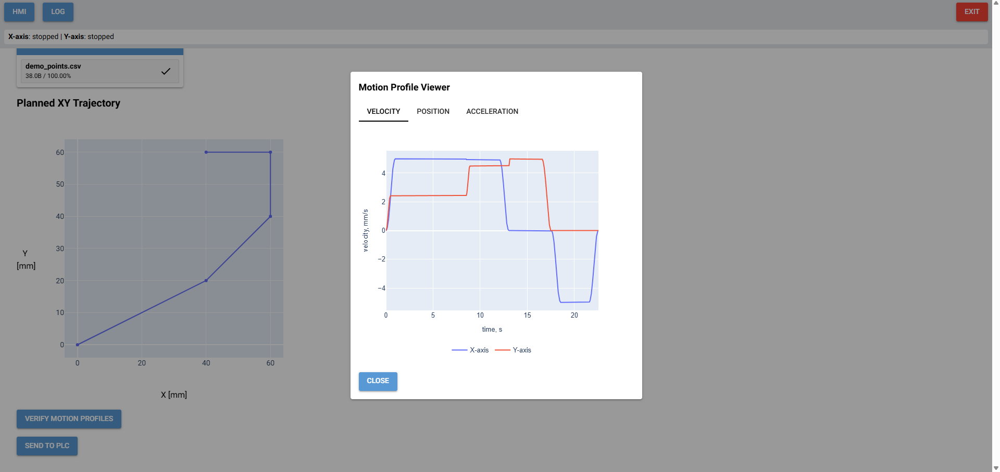
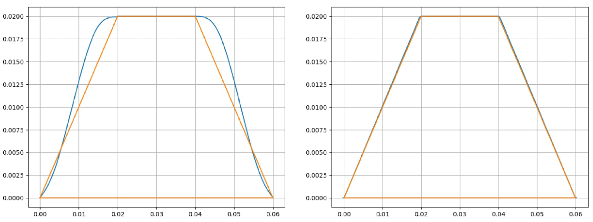

# PyBerryPLC Platform


## Overview

**PyBerryPLC is a Python-based platform for programmable logic controller (PLC) applications using the Raspberry Pi.**

With PyBerryPLC, PLC programs are written entirely in Python. Beyond classic PLC functionality, the platform enables you
to control stepper motors via A4988 or TMC2208 drivers. You can define motion profiles —trapezoidal or S-curve— and also
synchronize either two or three stepper motors for 2D (XY) or 3D (XYZ) trajectory motion. Additionally, PLC programs can
be extended with a web-based Human Machine Interface (HMI) built using NiceGui.

PyBerryPLC was created out of a practical curiosity to explore how PLCs function and what’s involved in controlling and 
managing technical processes and machinery with a computer. Today, with versatile languages like Python and accessible, 
affordable hardware such as the Raspberry Pi, this is entirely feasible.

This software might be useful for anyone interested in practical automation and motion control applications.



## Package Structure

### `core`

**Provides all the essentials for developing a PLC application.**

Each PLC application is implemented as a class derived from the abstract base class `AbstractPLC` in `plc.py`. This base
class implements the PLC scan cycle in its central `run()` method and defines abstract methods to be implemented in your
subclass: `control_routine()`, `exit_routine()`, `emergency_routine()`, and `crash_routine()`.

`AbstractPLC` also offers functions to add digital inputs, outputs, and memory variables (markers) to your application. 
Digital I/O is mapped to the Raspberry Pi’s GPIO pins, utilizing `gpiozero` and the underlying `pigpio` library 
(see `gpio.py`). Note: `pigpio` must be installed and running as a background daemon (`pigpiod`).

To link a PLC application with an HMI, use the `SharedData` data class from `shared_data.py`. This allows PLC and HMI 
components to exchange data and signals.

### `stepper`

**Enables connection and control of stepper motor drivers, with concrete classes for both A4988 and TMC2208 drivers.**

Core stepper motor functionality resides in `base.py` within the `driver` subpackage, which defines the abstract base 
class `StepperMotor`. The A4988 implementation is in `a4988.py` (`A4988StepperMotor`), and the TMC2208 implementation is
in `tmc2208.py` (`TMC2208StepperMotor`).

The TMC2208 driver also supports UART communication. The `uart` subpackage provides the necessary infrastructure: 
`uart_registers.py` defines the abstract `Register` class, and `tmc2208_registers.py` contains concrete register classes 
(e.g., `GCONFRegister`, `CHOPCONFRegister`). The `TMC2208UART` class in `tmc2208_uart.py` offers a user-friendly 
interface for register access.

Stepper motors can be rotated in various ways, primarily distinguished as "blocking" (the PLC scan cycle pauses until 
the move completes) or "non-blocking" (the scan cycle continues while the move executes). Rotations can be for a fixed 
angle, follow a motion profile, or run indefinitely. The "rotator" concept, implemented by the abstract `Rotator` class 
in `base.py` (`driver` subpackage), supports these modes. Derived rotator classes include:

| Blocking Rotation | Non-blocking Rotation |
| :-- | :-- |
| `FixedRotator` | `FixedRotatorThreaded` |
| `ProfileRotator` | `ProfileRotatorThreaded` |
|  | `DynamicRotatorThreaded` |

A specific `Rotator` is attached to a `StepperMotor` instance via the `attach_rotator()` method.

Stepper motors are driven by pulse trains on the STEP pin, with pulse timing calculated internally. For synchronized 
multi-motor control, use multiprocessing: each motor runs in a separate process. The `process.py` module in the `controller`
subpackage provides `MPMCProcess` (for single motion profiles) and `SPMCProcess` (step pulse motor control for planar 
trajectories). Communication between motor processes and the PLC (master process) uses a `Pipe` object. Both classes 
utilize a `TwoStageProfileRotator`, separating pulse train calculation (`preprocess()`) from rotation execution 
(`rotate()`).

### `motion`

**Provides tools for defining motion profiles and trajectories.**

The main modules are `multi_axis.py` and `trajectory.py`.

`multi_axis.py` defines the abstract `MotionProfile` class and its concrete implementations, `TrapezoidalProfile` 
and `SCurvedProfile`, enabling you to specify motion profiles for stepper motors.

`trajectory.py` contains everything needed to execute two- or three-dimensional trajectories with two or three synchronized stepper 
motors (X, Y and Z axes) and minimized path deviations. The key class is `TrajectoryPlanner`, which takes a 
series of $(x, y, z)$ points representing the start and end of each trajectory segment. The result is a `Trajectory` 
object —a list of `Segment` objects, each containing motion profiles and rotation directions for the axes, allowing you 
to verify profiles before execution.



### `hmi`

**Lays the foundation for building HMI applications with NiceGui.**

`base.py` defines the abstract base class `AbstractHMI`, which serves as the foundation for web-based HMI applications. 
Your HMI application should inherit from `AbstractHMI` and implement the `build_gui()` method to construct the graphical
user interface. The PLC application class is passed via the `__init__()` method. Internally, the PLC application runs in
a separate thread managed by `PLCThreadManager`, allowing for automatic restarts if the PLC program crashes.


## License

This project is licensed under the MIT License. See the LICENSE file for details.


## Getting Started

Clone the repository and install dependencies:

```
git clone https://github.com/TomLXXVI/pyberryplc-platform.git
cd pyberryplc-platform
pip install -r requirements.txt
```

When this is done, you might want to explore the `demos` folder, which contains practical examples covering PLC logic, 
GPIO control, stepper motor motion, HMI interaction, and full multi-axis trajectories.
