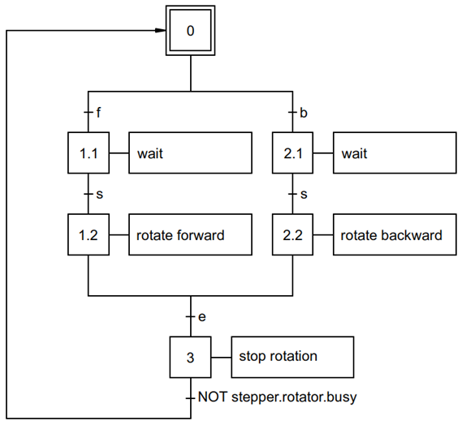

# DEMO 4 : Single Stepper Motor - Non-Blocking Mode - Dynamic Rotation

Hardware used:
- 1 Raspberry Pi 4
- 1 stepper driver MKS TMC2208 v2.0
- 1 stepper motor NEMA17 12 Vdc - 350 mA (model XY42STH34-0354A)
- 2 LEDs (red and yellow) and 2 resistors 220 Ohm

"Dynamic rotation" here means that the duration of the rotation is not 
predetermined. Once rotation has started, the motor continues to run until a 
command is given to stop it. Dynamic rotation is non blocking.

The stepper motor can run either in the forward rotation direction when the 
f-key is pressed, or the backward rotation direction when the b-key is pressed.
Rotation starts when the s-key is pressed, and stops when the e-key is pressed.
The SFC below graphically represents the flow of the PLC program.  

The stepper motor is controlled by a TMC2208 driver, which is configured via 
its UART-interface.

The Python script is started from a shell script to allow the keyboard buttons 
to be used as input for the PLC program. The shell script starts the Python 
script and its associated virtual environment as the root user, because the 
external package `keyboard` requires the root user.
