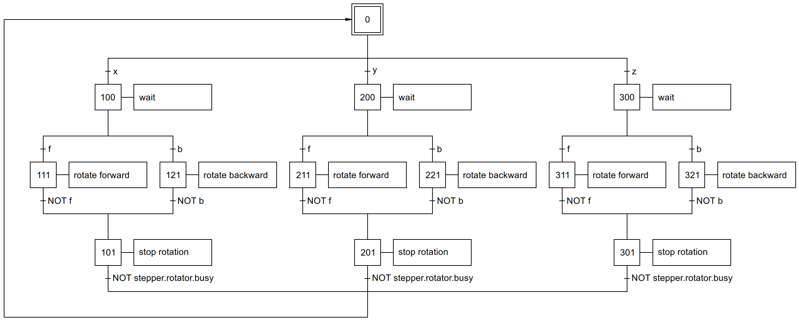

# DEMO 5 : MULTI-AXIS MOTION - JOG MODE

Hardware used:
- 1 Raspberry Pi 4
- 3 stepper drivers BIGTREETECH TMC2208 v3.0
- 3 stepper motors NEMA17 24 Vdc - 1.3 A

Consider a machine with three axes of motion: the X-axis, the Y-axis, and the 
Z-axis. The axes can be moved manually. To move an axis, we first select it: the
x key selects the X-axis, the y key selects the Y-axis, and the z key selects 
the Z-axis. Next, we choose the direction of motion: holding down the f key 
moves the selected axis forward; holding down the b key moves the selected axis 
backward. As soon as the f or b key is released, motion stops and a new axis of 
motion can be selected. The SFC below graphically represents the flow of the 
PLC program.

We use stepper motors with a "dynamic rotator," as in demonstration 4. The step 
sequence is the same for each of the three motion axes. We can reduce the PLC 
program's writing effort by placing the step sequence for one motion axis in a 
subroutine.

.png)

Each stepper motor is controlled by its own TMC2208 driver, which is configured 
via its UART-interface.

The Python script is started from a shell script to allow the keyboard buttons 
to be used as input for the PLC program. The shell script starts the Python 
script and its associated virtual environment as the root user, because the 
external package `keyboard` requires the root user.

> **NOTE** 
To set the current via UART, the current is expressed as a percentage. The 
`stepper_current_setting.py` script calculates the current percentage 
corresponding to the rated RMS current of the stepper motors used.
