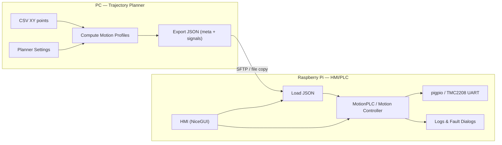

# ARCHITECTURE.md — demo\_10

> Project: **PyberryPLC CNC HMI — demo\_10**\
> Scope: PC Trajectory Planner + Raspberry Pi HMI/PLC Executor

---

## 1. Context & Goals

- **Goal**: separate **planning** (PC) from **execution** (RPi) for CNC‑like motion, to keep runtime timing simple and predictable on the Raspberry Pi.
- **Axes**: **X** and **Y** run automatic 2D trajectories; **Z** is **Jog‑only** for manual positioning.
- **Drivers**: **TMC2208** stepper drivers with **UART enabled** (required).
- **UI**: NiceGUI web apps on both PC and RPi (default port **8081**).

The demo focuses on the execution of **precomputed** trajectories rather than online planning. The PC produces a JSON step plan; the RPi consumes and executes it.

---

## 2. System Overview



**Responsibilities**

- **PC / Planner**: import path (CSV), choose profile & limits, compute position/velocity/acceleration profiles, derive step timing, export JSON.
- **RPi / HMI+PLC**: select JSON, initialize drivers, execute per‑segment step pulses, show logs/faults, provide Jog mode.

---

## 3. Component Responsibilities (by file)

```
demo_10/
  pc_side/
    trajectory_planner.py    # NiceGUI app: loads CSV, configures profiles, plots, exports JSON
    trajectory_outputs/      # Generated: <name>.meta.json, <name>.signals.json
    sftp.toml                # Host/user/path for optional SFTP push to the Pi

  rpi_side/
    hmi.py                   # NiceGUI HMI: select/load JSON, start/stop execution, show logs/faults
    plc.py                   # PLC logic: orchestrates controller(s), executes segments
    motor_config.toml        # Axis/motor/driver config (pitch rev/m, microstep, positive rotation reference)
    main.py                  # Convenience entry point
```

**pyberryplc library (relevant packages)**

- `core/` — PLC scaffolding, GPIO abstractions, timers, memory.
- `motion/` — trajectory & profiles (used on PC for planning).
- `stepper/` — controller/driver/process for stepper timing.
- `charts/` — plotting helpers used by the planner.
- `utils/` — general utilities.

> Convention: application code must use the **abstractions** (e.g., from `pyberryplc.core`), not raw `gpiozero`.

---

## 4. Runtime Model (RPi)

- Each axis is driven by a **controller** that may run in a **separate process** to preserve timing precision for step pulses.
- **pigpio** is used for deterministic GPIO toggling; ensure the **pigpiod** daemon is running.
- The executor consumes a sequence of **segments**. A segment fixes **direction** and provides a timed **step sequence** (or per‑axis step timing arrays). Between segments, the controller updates direction pins and timing.
- **Z‑axis** is available only in **Jog Mode** in this demo.

**Threading/Processes** (typical):

- HMI main thread (NiceGUI server) → triggers PLC actions.
- PLC/control process(es) for axes → generate step pulses using pigpio callbacks / waveforms.

---

## 5. Data Flow & Formats

### 5.1 Planner Input

- **CSV** with XY points (path coordinates). Parser builds a discrete path for profile computation.

### 5.2 Planner Output

- `` — metadata: path length, total time, profile type, planner settings snapshot.
- `` — execution payload: per‑segment directions and step timing (may be packed/optimized).

**Signals JSON (simplified illustration)**

```json
{
  "axes": ["X", "Y"],
  "segments": [
    {
      "dir": {"X": 1, "Y": 0},
      "steps": {"X": [1, 0, 1, ...], "Y": [0, 1, 0, ...]},
      "step_delays_ns": [12000, 12000, 11800, ...]
    }
  ]
}
```

> Actual schema in code may use compact arrays per axis or waveforms; this doc captures the conceptual contract: **per‑segment direction + timed steps**.

### 5.3 Transfer

- Optional **SFTP** push from PC to Pi (configured via `pc_side/sftp.toml`). Alternatively, copy files manually.

### 5.4 Execution

- HMI lists available JSONs, loads selected plan, and invokes the PLC to run segments in order.

---

## 6. Configuration

### PC

- `pc_side/sftp.toml` — connection parameters to deliver JSON to the Pi.

### Raspberry Pi

- `rpi_side/motor_config.toml` — axis & driver setup:
  - **Pitch (revolutions per meter)**
  - **Microstepping** (e.g., 1, 2, 4, 8, 16)
  - **Positive reference of rotation direction** (what is considered positive)
- **pigpiod** — must be enabled and running.
- **TMC2208 UART** — ensure the UART interface is enabled and correctly wired.

---

## 7. Key Design Decisions

- **Precompute on PC**: avoids heavy numeric work on the RPi, improving determinism of GPIO timing.
- **Per‑axis processes**: isolate timing loops from UI/PLC logic; helps achieve more reliable step pulse generation.
- **TMC2208 over UART**: runtime configuration + status via a robust, accessible interface on the Pi.
- **JSON interchange**: human‑readable, easy to debug, versionable with Git.

Trade‑offs:

- Less flexibility for online re‑planning during execution.
- Slightly larger storage (JSON) vs a binary format; acceptable for demo scale.

---

## 8. Quality Attributes

- **Timing precision**: critical for smooth motion; achieved via pigpio and isolated processes.
- **Safety**: HMI indicates faults; recommend limit switches and conservative initial speeds.
- **Observability**: log viewer in HMI, plus fault dialogs for critical events.
- **Portability**: pure‑Python planner on PC; RPi execution relies on pigpio and UART.

---

## 9. Failure Modes & Recovery

- **Port 8081 already in use**: stop previous NiceGUI process (fg + Ctrl‑C) or change port.
- **pigpio not running**: start/enable `pigpiod` service.
- **UART not enabled / wiring issues**: verify TMC2208 RX/TX, GND, and voltage levels.
- **Malformed / incompatible JSON**: planner and executor versions must match; validate file pair (.meta + .signals).
- **No motion / wrong direction**: confirm motor enable, UART config, **positive rotation reference**, and microstepping.

---

## 10. Security & Access

- **SFTP**: restrict to a dedicated user and path on the Pi; avoid password reuse.
- **HMI exposure**: the NiceGUI server listens on a port; if exposed beyond localhost, ensure your LAN is trusted or use a reverse proxy with auth.

---

## 11. Roadmap & Extension Points

- Add **Z‑axis** to automatic execution.
- Stream **telemetry** (position/velocity) back to the HMI during runs.
- Support additional **profile types** and trajectory primitives.
- Add a **binary** export for compact step plans if JSON size becomes an issue.
- Provide **make**/scripts for `make run-planner` and `make run-hmi`.
- Continuous integration for unit tests (profiles, exporter, executor timing).

---

## 12. Glossary

- **Pitch (rev/m)**: motor revolutions per meter of travel.
- **Positive rotation reference**: configured direction treated as positive for an axis.
- **Segment**: a contiguous motion block with fixed direction and a sequence of timed step pulses.

