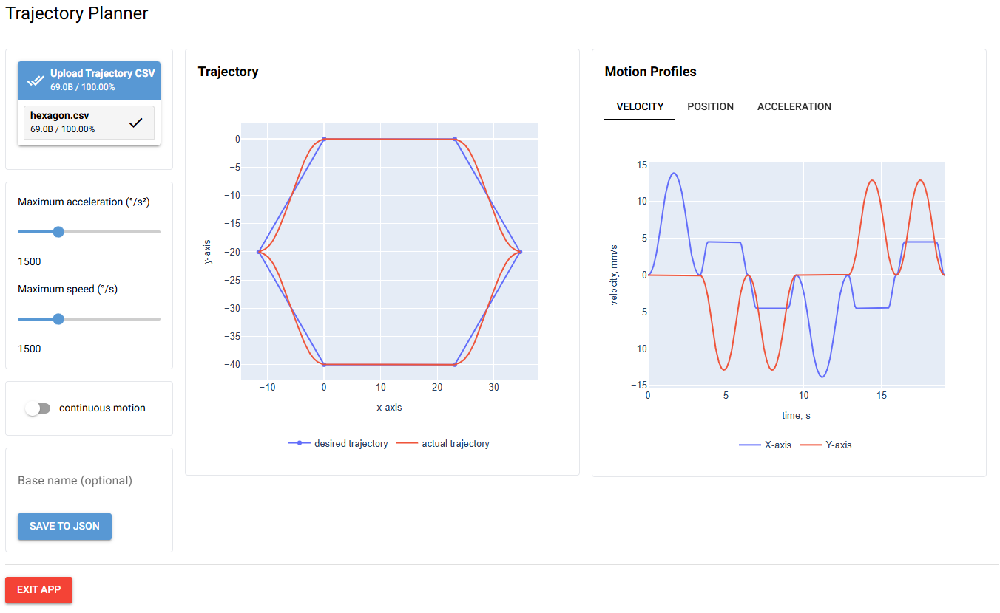
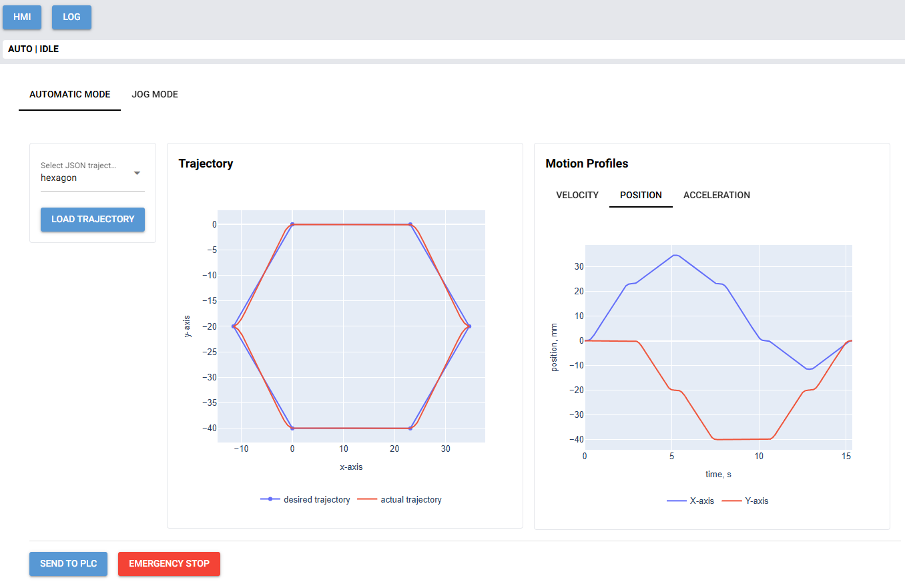

# Demo 10 — PC Trajectory Planner + Raspberry Pi HMI/PLC Executor

> Part of the **PyberryPLC Platform**

## Overview

This demo illustrates a clear separation between **trajectory planning** on a PC and **trajectory execution** on a 
Raspberry Pi. It is designed for CNC-style motion control using stepper motors driven by the `pyberryplc` package.

- **PC side**: `trajectory_planner.py` (NiceGUI app) loads XY coordinate paths from CSV, lets you configure motion 
limits and profiles, visualizes paths and motion profiles, and generates JSON step sequences.
- **Raspberry Pi side**: `hmi.py` (NiceGUI app) loads a precomputed JSON trajectory and executes it via the PyberryPLC 
motion controller framework.

## Required hardware

- Three stepper motors:
  - **X-axis** and **Y-axis**: used in Automatic Mode to follow 2D trajectories.
  - **Z-axis**: controlled only in Jog Mode for manual positioning.
- Compatible CNC mechanics or a test rig for mounting the motors (e.g. RATTMMOTOR CNC 1610 Pro).
- TMC2208 stepper motor drivers with UART interface enabled (one per axis).
- Raspberry Pi with GPIO access and `pigpio` support.
- Wiring, power supply, and optional limit switches for safety.

## Folder structure

```
demo_10/
  pc_side/
    sftp.toml                     # Connection settings for SFTP transfer to Pi
    trajectory_outputs/            # Saved JSON trajectories (meta + signal files)
      *.meta.json                  # Metadata about a generated trajectory
      *.signals.json               # Step pulse sequence for execution
    trajectory_planner.py          # NiceGUI trajectory planner application

  rpi_side/
    hmi.py                         # NiceGUI HMI application on Raspberry Pi
    main.py                        # Entry point for starting the HMI/PLC
    motor_config.toml              # Motor and driver configuration
    plc.py                         # PLC logic for executing loaded trajectory
```

## PC side — Trajectory Planner



### Features

- Load a CSV file with XY coordinates.
- Configure motion limits: maximum velocity, acceleration, microstepping, etc.
- Visualize position, velocity, and acceleration profiles.
- Export trajectory to JSON (two files per path: `.meta.json` and `.signals.json`).
- Transfer JSON directly to the Raspberry Pi via SFTP.

### Run

Before running the demo, make sure you have activated the project’s virtual environment on your PC:

```bash
# On Linux/macOS
source .venv/bin/activate
# On Windows (PowerShell)
.venv\Scripts\Activate.ps1
```

Install the `pyberryplc` package in editable mode:

```bash
pip install -e .
```

Then start the planner:

```bash
cd demo_10/pc_side
python trajectory_planner.py
```

Open the application in your web browser at:

```
http://localhost:8081
```

If accessing from another device on the network, replace `localhost` with the PC’s IP address.

## Raspberry Pi side — HMI/PLC



### Features

- **Automatic Mode**: Select a JSON trajectory file, load it, and start execution.
- **Jog Mode**: Manually move axes for setup or calibration.
- Real-time logging and visual fault indicators.
- Integration with the PyberryPLC motion controller, which requires TMC2208 stepper motor drivers with an enabled UART 
interface.

### Run

Before running the demo, make sure you have activated the project’s virtual environment on the Raspberry Pi:

```bash
source .venv/bin/activate
```

Install the `pyberryplc` package in editable mode:

```bash
pip install -e .
```

Then start the HMI:

```bash
cd demo_10/rpi_side
python hmi.py
```

Open the application in your web browser at:

```
http://localhost:8081
```

If accessing from another device on the network, replace `localhost` with the Raspberry Pi’s IP address. Make sure 
`pigpiod` is running:

```bash
sudo systemctl enable --now pigpiod
```

## Configuration

- On the **Raspberry Pi** side, `motor_config.toml` stores axis, motor, and driver configuration settings.
- On the **PC** side, `sftp.toml` stores connection information for copying files from the PC to the Pi.

## JSON trajectory format

Two files are generated for each planned trajectory:

- **`.meta.json`**: Metadata (e.g. path length, total time, parameters used).
- **`.signals.json`**: Contains per-axis step pulses, direction settings, and step delays.

## Dependencies

Both PC and Raspberry Pi require Python 3.11+ and the dependencies listed in the project’s `requirements.txt`.

Additional requirements for the Raspberry Pi:

- `pigpio` (with daemon running)
- Access to GPIO pins for stepper drivers
- TMC2208 stepper motor drivers with UART interface enabled

## Safety notes

- Always verify limit switch functionality before automatic execution.
- Start with conservative speed and acceleration settings.
- Ensure correct wiring and adequate cooling for motor drivers.
- Keep an emergency stop mechanism within reach.

